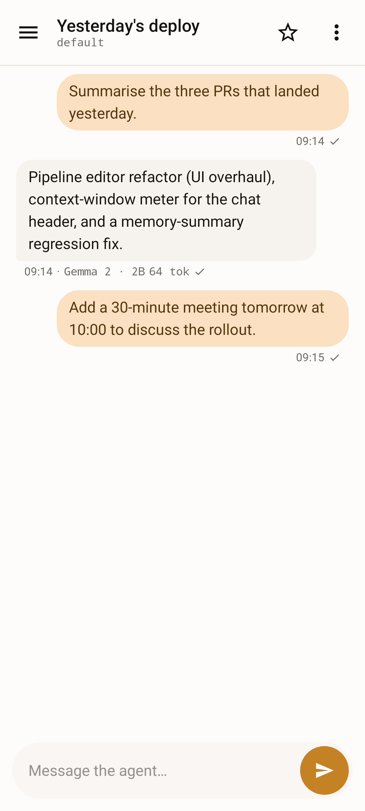
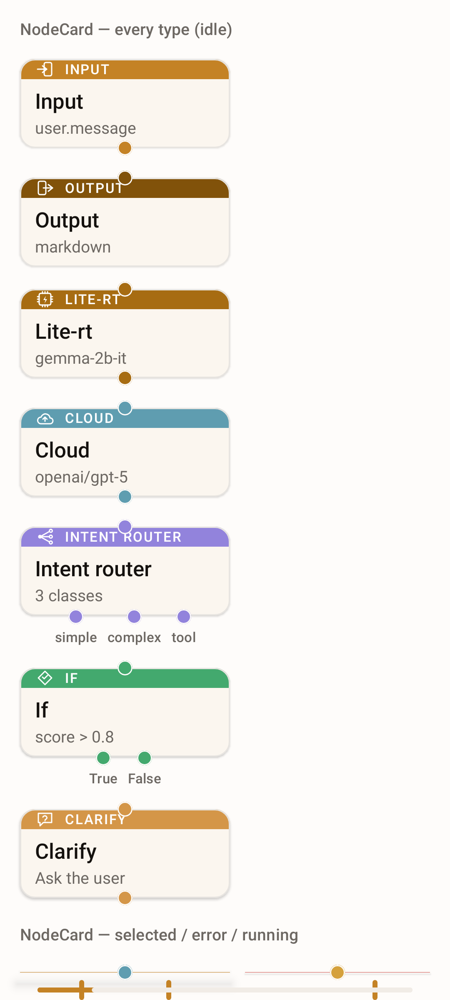
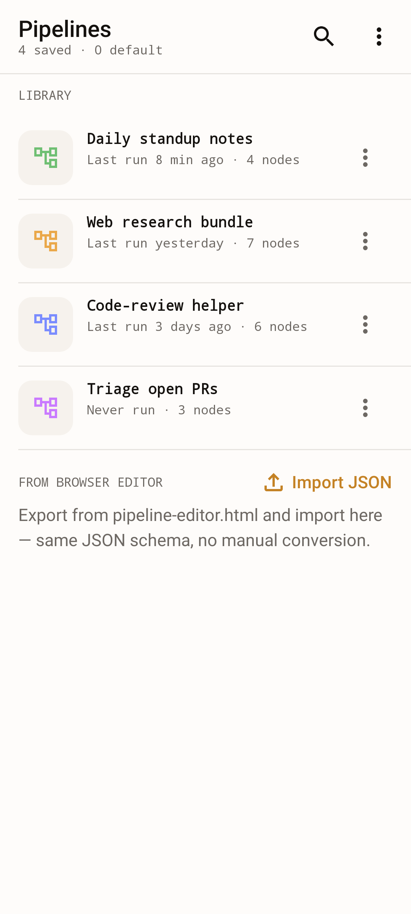
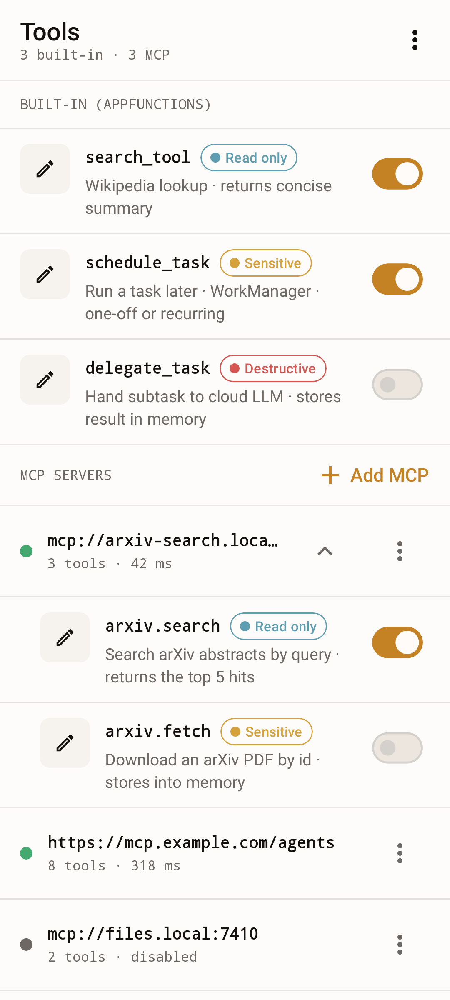
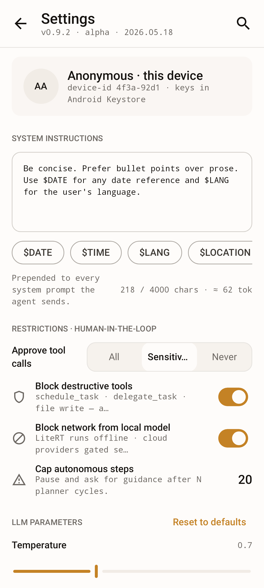

# On-Device AI Agent for Android

[](https://github.com/alexeyw/PersonalAndroidAIAgent/actions/workflows/check.yml)
[](LICENSE)


> An autonomous AI agent that runs on the device, understands natural language,
> plans tasks, and takes real actions across Android — without requiring an
> internet connection.

<picture>
  <source media="(prefers-color-scheme: dark)" srcset="docs/images/hero-chat-home-dark.png">
  
</picture>

> The Knotwork chat surface — every message is processed end-to-end on-device
> by a user-editable pipeline of typed nodes (input, local LLM, cloud LLM,
> tools, routing, output). The drag-and-drop pipeline editor lives one tap
> away under the **Pipelines** tab.

## Pre-release notice

This project is currently at **version 0.4.0** and is published for review and
experimentation. Expect rough edges:

- There are no stability guarantees for the public surface (Kotlin APIs,
  pipeline JSON schema, settings layout) between versions.
- On-device storage formats (encrypted preferences, exported pipeline JSON)
  may still change between versions.
- **Upgrades preserve local data.** Every Room schema-version bump ships with
  an explicit migration, so an in-place update keeps your chat history,
  long-term memory, run traces, custom pipelines, and saved presets / prompt
  templates. (Note: *downgrading* to an older build recreates the database
  empty — forward migrations cannot be reversed — so export anything you want
  to keep before installing an older version.)
- **Signing identity will change before the first signed release.** Builds up
  to and including `0.4.0` are signed with the Android debug keystore. Once a
  real release keystore is configured, the signer changes, and Android will
  **refuse to update a debug-signed install in place** (signature mismatch).
  When that happens you must uninstall the old build first — which clears its
  local data — before installing the release-signed one.

## Overview

The agent is an autonomous assistant for Android that takes a user request in
natural language, decides what to do, and carries the work out across the
device. Inference happens on-device via **LiteRT-LM** (the successor to
TensorFlow Lite, part of Google Edge AI), so a typical conversation —
including planning, tool invocations, and final replies — never leaves the
phone.

Pipelines are first-class. Every chat session is processed by a graph of
typed nodes (input, local LLM, optional cloud LLM, tool calls, routing,
decomposition, evaluation, clarifications, output) that the user can edit
either inside the app or in a standalone browser editor. Built-in prompt
variables let system prompts pull live values (current time, active model,
recent long-term memory) at render time without baking them into the
template.

Tools are wired through **AppFunctions Jetpack** for local actions and the
**Model Context Protocol (MCP)** for external servers. Destructive or
sensitive tool calls go through a human-in-the-loop gate so the agent
cannot, for example, send a message or delete a file without the user
seeing the request first. Cloud LLM providers are optional and bring-your-
own-key; nothing is sent off-device unless the user has explicitly
configured it.

## Key features

- Local LLM inference through LiteRT-LM with optional NPU/GPU acceleration.
- Optional cloud providers: OpenAI, Anthropic, Google (Gemini), DeepSeek,
  Ollama — all opt-in, bring-your-own-key.
- Model Context Protocol (MCP) client for connecting external tool servers.
- AppFunctions Jetpack integration for on-device tool calls.
- Knotwork **pipeline editor** with pan / pinch-zoom canvas, snap-to-grid
  drag-and-drop, long-press radial node picker, Sugiyama auto-layout,
  inline validation bar with focus-on-error, run-trace bar, undo / redo,
  and per-type configuration sheets for all 12 node types.
- Pipeline library with per-chat binding, plus rename / duplicate / delete.
- Prompt variables (`$DATE`, `$TIME`, `$TOOLS`, `$MODEL`, `$MEMORY_SUMMARY`,
  `$LANG`, `$LOCATION`, `$USER`, `$DEVICE`) rendered fresh on every
  execution.
- Redesigned **Settings** screen with identity card, structured
  HITL restrictions, sampling/repetition controls, memory dashboard
  (Chunks · Size · Threads · Avg score + Export / Import / Re-embed / Clear),
  test-backend probe metrics, and a long-running-task notification
  channel.
- **Local model manager** with an inline Active card, HuggingFace
  token + custom URL download fields, and preset rows showing live
  download progress / on-disk status.
- **Prompt library** — `ScrollableTabRow` of categories, per-card
  edit / delete / duplicate actions, inline `$VAR` highlighting in
  the body, and a `ModalBottomSheet` editor with `INSERT` chip row.
- **Task monitor** — filterable list of WorkManager background tasks
  and live chat sessions with swipe-to-cancel and a detail bottom
  sheet on row tap.
- **Live metrics** screen surfacing inference time, tokens-per-second,
  total tokens, per-node-type breakdown, and recent system logs;
  shows a power-saving banner when the system is throttling.
- **More tab** with live counters per row (memory chunks, active
  model, prompt categories, active task count + badge) and a footer
  privacy pill (`on-device · no network calls in last N m`) driven
  by a new `NetworkActivityTracker`.
- **About** screen with brand mark, version / build / commit info,
  hand-maintained acknowledgments list, and Open license / Read
  privacy policy links.
- Agent-initiated clarifications: the agent can ask the user a question
  mid-pipeline and wait for the reply (human-in-the-loop).
- Multi-session chats with a priority task queue and a redesigned chat
  home built on the Knotwork design system, covering the documented
  Empty / Idle / Generating / HITL / Clarification / Error / Drawer /
  Console-expanded states deterministically. Drawer / overflow secondary
  affordances — new chat with pipeline picker, rename, favorite, JSON
  import / export, in-chat model picker, Settings deep-link — are wired
  directly into chat home.
- Background execution as an Android Foreground Service with explicit idle
  and power-state management.
- Long-term memory with semantic retrieval (RAG) over past conversations,
  including automatic extraction of durable facts from finished conversations
  (toggleable in Settings → Memory), manual "Save to memory" from any chat
  message, and a redesigned memory manager — provenance breakdown, category
  filters, semantic search with relevance scores, inline edit + tags, manual
  add, one-tap compaction with an estimate, and JSON export / import
  (Merge or Replace, with background re-embedding when the source device used a
  different embedding provider).
- Standalone browser-based editor (`pipeline-editor.html`) for authoring
  and exporting pipelines without launching the app.
- Opt-in Firebase Crashlytics for anonymous crash reporting — off by
  default, never collects message content. See [SECURITY.md](SECURITY.md).
- At-rest encryption: Room database is SQLCipher-encrypted, API keys live
  in `EncryptedSharedPreferences` backed by the Android Keystore.

## Screenshots

Every image below is captured at 1080 × 2400 from a Roborazzi baseline
(`./gradlew :catalog:recordRoborazziDebug --tests "*HeroSnapshotTest*"`),
which means the README and the design-system regression suite are
guaranteed to stay in sync. Hover over (or tap) an image to see the dark
variant via your browser's `prefers-color-scheme`.

<table>
  <tr>
    <td align="center">
      <picture>
        <source media="(prefers-color-scheme: dark)" srcset="docs/images/hero-pipeline-editor-dark.png">
        
      </picture>
      <br><sub><b>Pipeline editor</b> — typed nodes (input · output · LiteRT · cloud · intent router · if · clarify · …)</sub>
    </td>
    <td align="center">
      <picture>
        <source media="(prefers-color-scheme: dark)" srcset="docs/images/hero-pipeline-library-dark.png">
        
      </picture>
      <br><sub><b>Pipeline library</b> — saved pipelines + import-from-browser-editor JSON</sub>
    </td>
  </tr>
  <tr>
    <td align="center">
      <picture>
        <source media="(prefers-color-scheme: dark)" srcset="docs/images/hero-tools-dark.png">
        
      </picture>
      <br><sub><b>Tools</b> — built-in AppFunctions + MCP servers with per-tool risk + toggle</sub>
    </td>
    <td align="center">
      <picture>
        <source media="(prefers-color-scheme: dark)" srcset="docs/images/hero-settings-dark.png">
        
      </picture>
      <br><sub><b>Settings</b> — identity card, system instructions with <code>$VARIABLE</code> chips, restrictions, LLM params</sub>
    </td>
  </tr>
</table>

## Requirements

- Android 16 or newer (API level 36+).
- Approximately 2 GB of free RAM available for the LLM at runtime.
- Optional: hardware acceleration via NPU or GPU for noticeably faster
  inference. CPU-only operation is supported but slower.

## Quick start

```bash
git clone https://github.com/alexeyw/PersonalAndroidAIAgent.git
cd PersonalAndroidAIAgent
./gradlew assembleDebug
adb install app/build/outputs/apk/debug/app-debug.apk
```

After installing:

1. Launch the app.
2. Open **Models** and download a LiteRT model through the built-in
   download manager. A small instruction-tuned model such as Gemma 2B from
   Hugging Face is a good starting point; you can also paste a custom URL.
3. Once the model finishes loading, send a first message from the chat
   screen to verify everything is wired up.

## Tech stack

| Layer            | Technology                                              |
|------------------|---------------------------------------------------------|
| Language         | Kotlin                                                  |
| UI               | Jetpack Compose + Material Design 3                     |
| Design system    | Knotwork (in-tree `:catalog` library)                   |
| Brand fonts      | Inter + JetBrains Mono (bundled TTF, SIL OFL 1.1)       |
| LLM engine       | LiteRT-LM (Google Edge AI / ex-TensorFlow Lite)         |
| Tool calling     | AppFunctions Jetpack                                    |
| MCP & cloud LLM  | Koog (MCP transport + cloud-LLM client only)            |
| Architecture     | Clean Architecture + MVVM                               |
| DI               | Hilt                                                    |
| Async            | Coroutines / Flow                                       |
| Network          | OkHttp + Ktor (via Koog)                                |
| Local storage    | Room + DataStore                                        |
| Testing          | JUnit + MockK                                           |

## Documentation

- Architecture overview — [docs/architecture.md](docs/architecture.md).
- User guide — [docs/user-guide.md](docs/user-guide.md).
- Extending the agent (new node types, tools, providers, prompt
  variables) — [docs/extending.md](docs/extending.md).
- Code style — [docs/code-style.md](docs/code-style.md).
- Testing strategy and coverage — [docs/testing.md](docs/testing.md).
- API & integration conventions — [docs/api-conventions.md](docs/api-conventions.md).
- Release-build playbook (R8, signing, AAB, APK size) — [docs/release.md](docs/release.md).
- Roadmap — [docs/roadmap.md](docs/roadmap.md).
- Contributing guide — [CONTRIBUTING.md](CONTRIBUTING.md).
- Code of Conduct — [CODE_OF_CONDUCT.md](CODE_OF_CONDUCT.md).
- Security policy and threat model — [SECURITY.md](SECURITY.md).
- Release notes and version history — [CHANGELOG.md](CHANGELOG.md).

## License

Released under the Apache License 2.0. See [LICENSE](LICENSE) for the full
text.
