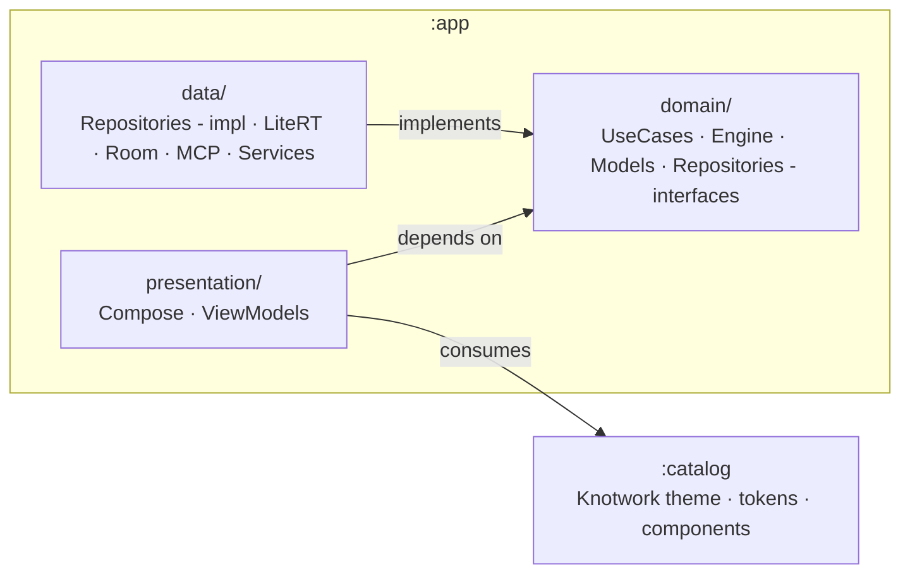
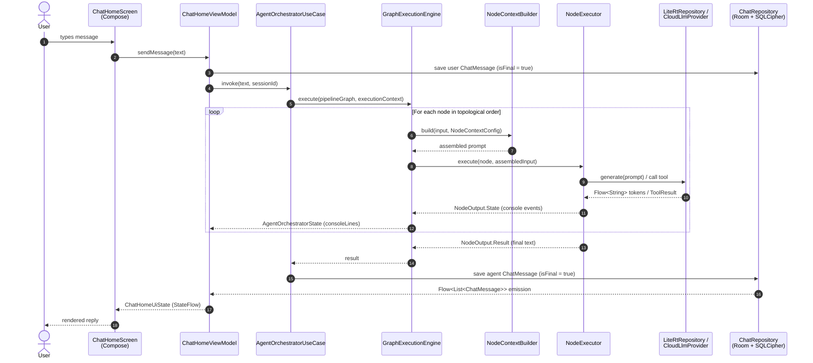
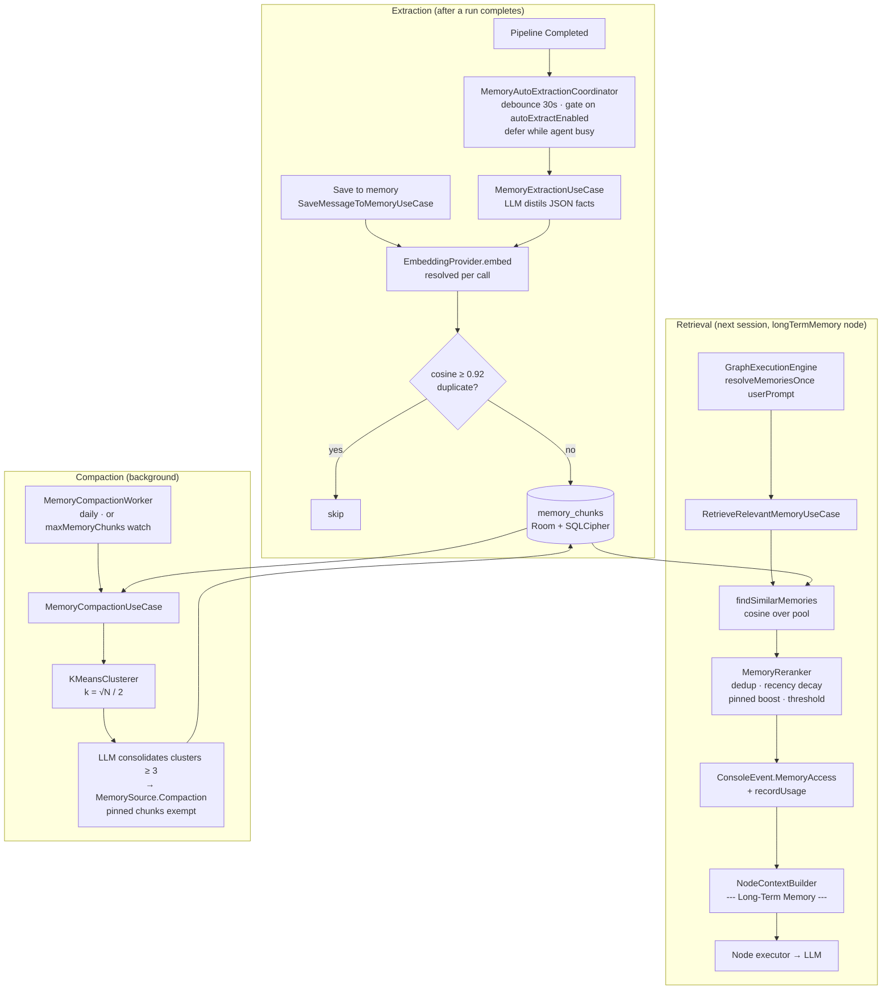
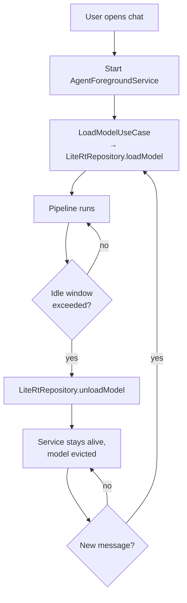

# Architecture

This document is a developer-facing overview of the On-Device AI Agent for
Android. It is intended for contributors and external readers who want to
understand the shape of the codebase without reading every file. For
end-user guidance, see [`docs/user-guide.md`](user-guide.md); for recipes
on adding new functionality, see [`docs/extending.md`](extending.md).

All diagrams below are written in [Mermaid](https://mermaid.js.org/) and
render natively in GitHub markdown — no external tooling required.

---

## 1. Clean Architecture overview

The codebase is split into three Gradle modules:

```
:app        — Android application; hosts presentation / domain / data layers
:catalog    — Knotwork design-system Android library (theme, tokens, components)
:tools-probe — Debug-only companion app for the AppFunctions end-to-end test
```

Inside `:app`, the source tree is split into the three Clean Architecture
layers under `app/src/main/java/ai/agent/android/`:

```
app/
├── presentation/   # Jetpack Compose UI, ViewModels (MVVM)
├── domain/         # Use cases, agent logic, tool abstractions, models
└── data/           # Repository implementations, engines, I/O, services
```

Dependencies flow strictly inward — `data` and `presentation` both depend
on `domain`, but `domain` depends on nothing else in the project. The
`domain` layer contains zero Android-framework imports (`android.*`,
`androidx.*`) and is pure Kotlin plus Coroutines.

`:catalog` is a leaf module: it exports `KnotworkTheme` and design-system
primitives, and depends on Compose only. `:app` consumes it as an
`implementation` dependency from the presentation layer; no domain or
data code is allowed to reference `:catalog`.



Each layer maps onto concrete packages:

| Layer          | Packages                                                                                          |
|----------------|---------------------------------------------------------------------------------------------------|
| `presentation` | `presentation/ui/{about,chat,memory,models,monitoring,more,onboarding,orchestrator,pipeline/editor,prompts,settings,splash,taskmonitor,tools}`, `presentation/ui/navigation`, `presentation/{components,state,theme,notifications,receivers}` |
| `domain`       | `domain/{usecases,engine,models,repositories,prompt,constants,services,pipelineio,promptio,memoryio}` |
| `data`         | `data/{engine,local,repositories,prompt,mcp,services,tools,network,mappers,logging}`              |

Cross-layer wiring is handled by **Hilt**. Modules in `di/` provide
external dependencies (Room, Retrofit, LiteRT, prompt-variable providers,
local-tool executors) and bind data-layer implementations to domain-layer
interfaces.

### 1.1. App shell and navigation

The presentation layer is hosted by a single `NavHost` declared in
`presentation/ui/navigation/AppNavGraph.kt`. The graph wires:

- **Splash** → **Onboarding** (only when `SettingsRepository.isFirstLaunch`
  is `true`) → **Chat tab**. After onboarding, the flag is persisted as
  `false` so subsequent launches go straight to Chat.
- Four top-level **tabs** rendered by `AppShellScaffold`'s Material3
  `NavigationBar` (decisions.md §12): **Chat / Pipelines / Tools / More**.
  Tab state — back-stack, scroll position, ViewModel state — is preserved
  across switches and rotations using the canonical
  `popUpTo(startDestination) { saveState = true } + restoreState = true`
  pattern.
- **Secondary destinations** live as additional `composable(...)` entries
  reachable from inside a tab. The pipelines tab is a nested `navigation { }`
  graph so the library and editor share a single `OrchestratorViewModel`
  scoped to the graph entry. The More tab is the umbrella for Memory,
  Models, Prompt library, Active tasks, Live metrics, Settings, and
  About.
- **Modal sheets** (`NodeConfigSheet`, `ConsolePane`, `AddMcpServerScreen`)
  share a single `KnotworkModalRoute` wrapper that combines Material3
  `ModalBottomSheet` with `PredictiveBackHandler` so Android 14+
  predictive-back animates the sheet in lockstep with the user's drag.
- Deep-links: `knotwork://chat/{threadId}` resolves to the parameterised
  `chat/{threadId}` route, forwarding the thread id to `ChatHomeViewModel.switchSession`.

Bottom-nav visibility per route is decided by the pure
`shouldShowBottomNav(route)` function (`BottomNavVisibility.kt`) — the
bar is hidden on Splash, Onboarding, Pipeline editor (full-screen
canvas), and any `sheet/...` route. While the user is on a tab's
start-destination, `BackHandler` short-circuits the system Back gesture
to `activity.finish()` so Back exits the app rather than switching tabs.

---

## 2. Data flow — life of a user message

The most common code path in the app is: the user types a message in the
chat screen and receives an agent response. The diagram below shows the
key actors and the order in which they collaborate.



Step-by-step notes:

1. The Compose layer is **stateless with respect to data** — `ChatHomeScreen`
   only observes `ChatHomeUiState` (a `StateFlow`) and forwards user input
   to `ChatHomeViewModel`. There are no direct repository or use-case calls
   from any `@Composable`.
2. `ChatHomeViewModel.sendMessage(...)` persists the user message first
   (so it survives crashes), then launches the agent on
   `viewModelScope`.
3. `AgentOrchestratorUseCase` resolves the pipeline bound to the active
   chat session (or the default one if the binding is `null`) and asks
   `GraphExecutionEngine` to run the graph.
4. `GraphExecutionEngine` walks the graph in topological order. For
   every node, it consults `NodeContextBuilder` to assemble the input
   prompt out of the blocks selected by the node's `NodeContextConfig`
   (see §3.2).
5. The matching `NodeExecutor` (one per `NodeType`, registered via Hilt
   multibinding) runs the node. Long-running nodes (`LITE_RT`, `CLOUD`)
   emit token-streaming and progress events as `NodeOutput.State`
   values; the terminal `NodeOutput.Result` carries the node's textual
   output to the engine.
6. While the graph executes, the engine emits
   `AgentOrchestratorState.ConsoleLog` events. The view-model folds
   them into the `consoleLines` flow exposed by `ChatHomeViewModel`,
   which `ChatHomeScreen` renders inside the dedicated console
   `ModalBottomSheet` overlay (opened from the agent-status pill above
   the composer). The console pane is **independent of the chat state
   machine** — it stays mounted across `Generating → HitlConfirm →
   Clarification` transitions instead of being a sealed `ChatHomeUiState`
   variant.
7. Intermediate node outputs are persisted with `isFinal = false`. The
   main message list filters those out via
   `ChatRepository.getDisplayMessagesForSession(...)`, but they remain
   available for debugging and export paths.
8. The final agent reply (`isFinal = true`) is saved through the
   repository; the resulting `Flow` emission updates the `messages` flow
   exposed by `ChatHomeViewModel` and the UI re-composes.
9. On the terminal `Completed` state, `ChatHomeViewModel` notifies the
   app-scoped `MemoryAutoExtractionCoordinator` (domain service). After a
   30-second per-session debounce — and only when
   `SettingsRepository.autoExtractEnabled` is set — it runs
   `MemoryExtractionUseCase`, which makes one local-model pass to distil
   durable facts from the recent dialogue, embeds them with the active
   `EmbeddingProvider`, drops near-duplicates, and writes survivors to
   `memory_chunks` tagged with `MemorySource.ChatSession`. This is
   fire-and-forget background work and never blocks or fails the chat.

### 2.1. Memory export / import and lazy re-embedding

Long-term memory is portable between devices. The `domain/memoryio`
gateway (`MemoryJsonSerializer`) serialises `memory_chunks` to a
`schemaVersion: 1` JSON document — stamped with the active
`embeddingProviderId` and an `exportedAt` timestamp — driven from
**Settings → Memory → Export** through a SAF stream
(`ExportMemoryBaseUseCase`). The provenance field reuses
`MemorySourceJson`, the same codec the Room `source` column converter
uses, so the on-disk encoding and the column stay identical.

Import (`MemoryImportUseCase`) parses the file (`Success` /
`SchemaMismatch` / `Failure`) and reconciles it under a user-chosen
strategy: **Merge** (insert only ids not already present) or **Replace**
(an atomic wipe-and-load, a no-op when the document carries no chunks),
preserving each chunk's id, provenance, pin state and tags. The parser
rejects chunks with a malformed embedding (empty array / non-finite
value) so a corrupt vector never reaches the store.

When the document's embedding provider differs from the importing
device's active **resolved** provider — `EmbeddingProviderResolver.resolve()`,
which accounts for the on-device fallback when the selected provider is
unavailable and is the same provider retrieval embeds queries with, not
the raw persisted setting — the inserted vectors live in an incompatible
space, so each chunk is flagged `needsReembedding` and the import
schedules a background pass through the `MemoryReembedScheduler` domain
seam (`APPEND_OR_REPLACE` so a second import always chains a fresh drain
rather than being coalesced away while a pass runs). `MemoryReembedWorker`
(a WorkManager `@HiltWorker`, mirroring `MemoryCompactionWorker`) then runs
`RecomputePendingEmbeddingsUseCase` off the hot path — re-embedding the
pending chunks in bounded batches (so a multi-thousand-chunk import neither
issues one oversized request nor loses progress on a mid-corpus failure)
and clearing the flag — with WorkManager retry/backoff if the provider is
temporarily unavailable. Retrieval never blocks on this; it simply
tolerates the not-yet-repaired chunks (whose cross-space vectors score ~0)
until the worker finishes. As a safety net for a one-off pass that was lost
(process killed before the enqueue persisted) or exhausted its retries,
`MainActivity` re-arms the worker on cold start whenever
`countMemoriesNeedingReembedding()` is non-zero. The manual *Settings →
Memory → Re-embed* action shares the same flag-clearing write so the two
repair paths converge.

### 2.2. Long-term memory lifecycle

Long-term memory is a vector store (`memory_chunks`) of durable facts
distilled from past conversations. The diagram below traces one fact from
the message that states it, through storage, to the moment a *later*
session retrieves it into a node's prompt — plus the background compaction
loop that keeps the table dense. Only the on-device LLM and the embedding
backend are model-dependent; everything else is plain domain code.



Key invariants:

1. **One retrieval per run.** The engine memoises memory off the immutable
   `userPrompt`, so multiple memory-enabled nodes in a graph share a single
   embed + search rather than re-querying per node.
2. **Same embedding space.** Both extraction and retrieval resolve the
   *active* provider via `EmbeddingProviderResolver`, so a query is always
   embedded with whatever produced the stored vectors; a mismatch (e.g. a
   chunk imported under a different provider) scores ~0 until re-embedded
   (see §2.1).
3. **Pinned is sacred.** Pinned chunks bypass the recency decay and
   threshold filter on retrieval and are never compaction candidates — the
   one mechanism a user has to guarantee a fact stays findable.

The on-device write path is covered end-to-end by the instrumented
`MemoryLifecycleIntegrationTest` (extract → retrieve into the context block
→ survive a compaction pass over a real Room database).

---

## 3. Pipeline engine

Pipelines are first-class. A `PipelineGraph` is a directed graph of typed
`NodeModel` values connected by `ConnectionModel` edges. The engine that
runs them is `GraphExecutionEngine`, decomposed into per-type
`NodeExecutor` strategies.

### 3.1. Node types

| `NodeType`         | Purpose                                                                                       |
|--------------------|-----------------------------------------------------------------------------------------------|
| `INPUT`            | Entry point. Echoes the user's original message downstream. Exactly one per graph.            |
| `LITE_RT`          | On-device LLM call via LiteRT-LM. Streams tokens as `Flow<String>`.                           |
| `CLOUD`            | Cloud LLM call. Provider (OpenAI / Anthropic / Google / DeepSeek / Ollama) selected by param. |
| `OUTPUT`           | Final answer to the user. Optionally wraps upstream text with a system prompt.                |
| `SUMMARY`          | Condenses tool results / multi-turn output into a single message.                             |
| `INTENT_ROUTER`    | Routes execution down one branch based on classified intent.                                  |
| `DECOMPOSITION`    | Splits a complex task into ordered subtasks; feeds them into a downstream queue.              |
| `EVALUATION`       | Scores or critiques an intermediate result; can short-circuit the graph.                      |
| `CLARIFICATION`    | Asks the user a follow-up question and suspends the pipeline until they answer.               |
| `TOOL`             | Invokes an AppFunctions or MCP tool. Gated by `ToolRisk` (see §4.2).                          |
| `IF_CONDITION`     | Boolean branch on a condition evaluated against the running context.                          |
| `QUEUE_PROCESSOR`  | Drains the priority task queue produced by `DECOMPOSITION`, one item per iteration.           |

### 3.2. `NodeContextBuilder` and the fixed block order

Every node receives an **assembled input**, not the raw text of the
previous node. `NodeContextBuilder` is the single source of truth for
that format. Each enabled block is wrapped in a `--- <Block Name> ---`
header; blocks are concatenated in this **fixed order** regardless of
which subset is enabled:

1. `--- Original Task ---` — the user message that started the current
   run.
2. `--- Chat History ---` — numbered conversation history with
   `USER`/`AGENT` roles.
3. `--- Long-Term Memory ---` — semantic-retrieval hits over past
   memory chunks. A vector search ranks chunks by cosine similarity;
   `MemoryReranker` then re-scores the pool (recency decay, a pinned
   boost, near-duplicate collapse, and a final-score threshold) before
   the top-K hits are injected.
4. `--- Tool Results ---` — outputs of every tool invocation made
   during the current run.
5. `--- Previous Node Output ---` — the text produced by the
   immediately upstream node.

The order is **not** an implementation detail. It is fixed for two
reasons:

- **Prompt cache stability.** Downstream LLMs (Anthropic, OpenAI, the
  local LiteRT runtime) hash the prefix to reuse cache. Reordering
  blocks between runs would invalidate that cache.
- **Position sensitivity.** LLMs respond best when the payload of the
  current iteration sits closest to the generation point, so
  `Previous Node Output` is always last.

An enabled block with no data does not produce an empty header — the
block is simply skipped. If no enabled block has content, the builder
returns an empty string.

### 3.3. `NodeContextConfig` flags

`NodeContextConfig` is a data class of five booleans, one per block:

| Flag             | Includes                                                                     |
|------------------|------------------------------------------------------------------------------|
| `originalTask`   | The user message that started the current pipeline run.                      |
| `chatHistory`    | Numbered messages from the active chat session (`USER` / `AGENT`).           |
| `longTermMemory` | Memory chunks retrieved by semantic search against the original task.        |
| `toolResults`    | All `toolName: output` snapshots accumulated during this run.                |
| `nodeInput`      | The text produced by the previous node in the chain.                         |

Recommended defaults per node type (`NodeContextConfig.defaultForType`):

- `INPUT`, `IF_CONDITION` → `nodeInput` only (control flow).
- `LITE_RT`, `CLARIFICATION`, `QUEUE_PROCESSOR`, `DECOMPOSITION`
  → `nodeInput + originalTask` (minimum context for a small model).
- `CLOUD`, `INTENT_ROUTER` → `nodeInput + originalTask + chatHistory`
  (large context window, history is cheap).
- `TOOL` → `nodeInput` only (the tool just needs its arguments).
- `SUMMARY`, `EVALUATION`
  → `nodeInput + originalTask + toolResults` (aggregation).
- `OUTPUT` → all five flags (final answer should see everything).

### 3.4. Validation rules

`PipelineGraph.validate()` enforces graph-level invariants before the
engine accepts a graph for execution:

- Exactly one `INPUT` node and at least one `OUTPUT` node.
- No cycles; the graph must be a DAG.
- Every connection refers to existing source and target node ids.
- Nodes for which `NodeModel.usesContextConfig() == true` must have at
  least one flag enabled — an empty config would feed the executor
  nothing to work with.
- Nodes that ignore the config (`INPUT`, `IF_CONDITION`,
  `QUEUE_PROCESSOR`, and `OUTPUT` when it has no `systemPrompt`) are
  exempt from the empty-config rule — they always forward upstream
  text verbatim.

System prompts on LLM-driven nodes can contain `$KEY` placeholders. The
`PromptTemplateEngine` substitutes them on every render via Hilt-bound
`PromptVariableProvider` instances. Built-in keys: `$DATE`, `$TIME`,
`$TOOLS`, `$MODEL`, `$MEMORY_SUMMARY`. Unknown placeholders are kept
verbatim and logged as a warning. See
[`docs/extending.md`](extending.md) for the recipe to add new
variables.

---

## 4. Integrations

### 4.1. LiteRT-LM (on-device inference)

`LiteRtRepository` is the contract between the agent and the on-device
model:

```kotlin
interface LiteRtRepository {
    suspend fun loadModel(modelPath: String): Result<Unit>
    fun generate(prompt: String): Flow<String>
    suspend fun unloadModel()
    val isModelLoaded: StateFlow<Boolean>
}
```

Rules the implementation guarantees:

- Model loading runs on `Dispatchers.IO` inside a coroutine. The native
  handle is held by a `ModelSession` wrapper.
- Inference is exposed as a **token-streaming** `Flow<String>` — UI and
  the orchestrator can render partial output as it arrives.
- A `Mutex` gates inference. Concurrent calls to `generate(...)` are
  serialized so the native session is never accessed from two
  coroutines at once.
- `ModelSession.close()` is called from `ViewModel.onCleared()` and
  from the foreground service's `onDestroy()` to release native memory
  and avoid OOM.
- Memory usage is logged with `Timber.d` before and after model load
  so that regressions show up immediately in logcat.

### 4.2. AppFunctions Jetpack (tool calling)

The agent talks to AppFunctions in two directions:

- **Caller-side** — the agent invokes AppFunctions exposed by *other*
  apps. `LocalAppFunctionManager` discovers them through
  `AppFunctionManager.observeAppFunctions(...)` and `ToolRepositoryImpl`
  merges the result into the visible tool catalogue (alongside built-ins
  and MCP tools). AppFunctions are keyed by their qualified name
  (`"${packageName}/${id}"`) so identical ids exposed by different
  packages can coexist. Dispatch goes through
  `LocalAppFunctionManager.invokeByName(...)`, which encodes arguments via
  `AppFunctionDataCodec`, calls
  `AppFunctionManager.executeAppFunction(...)`, and renders the response
  back into a flat JSON string for the agent's observation log. There is
  no longer any `intentionally not included` gating — discovered
  AppFunctions are first-class tools.
- **Callee-side** — the agent exposes a curated set of read-only
  built-ins to *other* apps. Wrappers live in
  `data/tools/local/appfunctions/` and are annotated with
  `androidx.appfunctions.service.AppFunction`. The auto-merged
  `androidx.appfunctions.service.PlatformAppFunctionService` (from
  `appfunctions-service`) advertises them through
  `app_functions_v2.xml` (generated by KSP with the
  `appfunctions:aggregateAppFunctions=true` arg in `app/build.gradle.kts`)
  and dispatches incoming requests through KSP-generated invokers.
  `App` implements
  `androidx.appfunctions.service.AppFunctionConfiguration.Provider` to
  supply Hilt-managed instances of those wrappers, so the callee path
  shares caches and rate limits with the caller path. The first wrapper
  is `SearchAppFunction`, a thin shell over the built-in `search_tool`
  (READ_ONLY). `schedule_task` and `delegate_task` are intentionally
  **not** exposed: scheduling a `WorkManager` job or burning the user's
  cloud API quota on behalf of a third-party caller would violate the
  user's expectation of agency.

Caveat: when a wrapper's package path contains a Kotlin soft keyword
(`data`, `value`, …), the AppFunctions compiler bakes Kotlin
source-level escaping into the generated wire id. `SearchAppFunction`'s
id therefore embeds literal backticks around `data`:
`` ai.agent.android.`data`.tools.local.appfunctions.SearchAppFunction#invoke ``
External callers must pass the backticks verbatim. The
end-to-end test (`AppFunctionsEndToEndTest.SEARCH_TOOL_ID`) and the
`:tools-probe` `MainActivity` constant are the source-of-truth literals.

Every tool — built-in, discovered AppFunction, or MCP — carries an
effective
[`ToolRisk`](../app/src/main/java/ai/agent/android/domain/models/ToolRisk.kt):

```kotlin
enum class ToolRisk { READ_ONLY, SENSITIVE, DESTRUCTIVE }
```

`AgentTool.risk` is informational on the model itself. The single source
of truth for HITL decisions is `ToolRepository.getRisk(name)`, which
merges three layers:

1. **Built-in tools** carry hard-coded constants set in
   `ToolRepositoryImpl.getBuiltinTools()`: `search_tool` → `READ_ONLY`,
   `schedule_task` → `SENSITIVE`, `delegate_task` → `SENSITIVE`.
2. **Discovered AppFunctions** (from `LocalAppFunctionManager`) default
   to `SENSITIVE` because the platform `AppFunctionManager` metadata
   gives no trustworthy signal about side effects. Users can override
   per-tool through
   `SettingsRepository.setAppFunctionRiskOverride(toolName, risk)`,
   which writes into the `appFunctionRiskOverrides` flow persisted
   under DataStore key `app_function_risk_overrides`. The override
   always wins over the conservative default.
3. **MCP tools** are blanket `SENSITIVE` until a per-server policy
   scheme is introduced.

HITL contract (live):

- Before dispatching a tool, `ToolNodeExecutor` resolves the tool's risk
  through `ToolRepository.getRisk(name)` and applies the gate:
  - `SENSITIVE` and `DESTRUCTIVE` — always emit
    `AgentOrchestratorState.WaitingForApproval(toolName, args, risk)` and
    suspend on the per-session approval `CompletableDeferred` until the
    user resolves it via the chat console row, the system notification
    action, or the configured timeout.
  - `READ_ONLY` — run without a prompt **unless** the user has globally
    enabled `SettingsRepository.requiresUserConfirmation`. That flag is
    now an opt-in "ask on every single tool call" override and never
    silences `SENSITIVE` / `DESTRUCTIVE`.
- `WaitingForApproval` carries the resolved `risk` so the chat console
  can render a coloured risk chip (`READ` / `SENS` / `DEST`) next to the
  tool name without re-resolving.
- The notification fallback (`ApprovalNotificationManager`) uses two
  `IMPORTANCE_HIGH` channels: `AgentApprovalChannel` for `SENSITIVE` /
  opt-in `READ_ONLY` and `AgentApprovalDestructiveChannel` for
  `DESTRUCTIVE`, with distinct icon and title so the destructive prompt
  is recognisable at a glance in the system shade.

### 4.3. Model Context Protocol (MCP)

External tool servers are integrated through MCP clients in
`data/mcp/` (`KoogMcpClient`, `McpClient`). `ToolRepositoryImpl` holds
active connections in a `ConcurrentHashMap<String, McpClient>` keyed by
server id. Connections are **lazy**: they open on first use and close
when the agent session ends. Every MCP call is wrapped in
`runCatching` and converted to a `ToolResult.Error` on failure — raw
exceptions never reach the presentation layer.

### 4.4. Cloud LLM providers

Cloud providers (`openai`, `anthropic`, `google`, `deepseek`, `ollama`)
implement the `CloudLlmProvider` interface in `domain`. They are
dispatched by the single unified `CLOUD` node, which takes the
provider id as a parameter — there is no provider-specific node type,
and adding a new provider does not require touching the pipeline
engine. API keys live in `EncryptedSharedPreferences` (see §5.2) and
are never serialized into DataStore or git.

---

## 5. Persistence

### 5.1. Room

The local database (`AppDatabase`, `agent_database.db`) holds chat
sessions and messages, long-term memory chunks, local-model metadata,
pipelines (nodes and connections), prompt templates, and pipeline
trace steps. DAOs are split per aggregate (`ChatDao`, `MemoryDao`,
`PipelineDao`, …) and live under `data/local/dao/`.

Migration rules:

- Schema migrations are explicit
  (`Migration(oldVersion, newVersion) { … }`).
- Auto-migrations are allowed for additive changes only.
- DAO methods returning `Flow<T>` are annotated with `@Query` — no
  ad-hoc reactive wrapping.
- Operations that touch multiple tables use `@Transaction`.
- `CoroutineDispatcher` is injected into data sources for
  testability; heavy I/O runs on `Dispatchers.IO`.

### 5.2. At-rest encryption

The Room database is encrypted at rest with **SQLCipher** via
`SupportOpenHelperFactory` from `net.zetetic:sqlcipher-android`.
Encryption applies to every table that may hold user-derived content:

- `chat_messages`, `chat_sessions` — user messages and LLM replies.
- `memory_chunks` — long-term memory fragments distilled from
  conversations.
- `trace_steps` — intermediate pipeline-node outputs derived from
  user input.

The SQLCipher passphrase is a 32-byte random value generated on first
launch and stored in `EncryptedSharedPreferences`. The master key
backing those preferences lives in the Android Keystore.
`EncryptedSharedPreferences` also stores per-provider cloud API keys.

User-tunable settings (sampling parameters, timeouts, pipeline-step
bounds, default pipeline id, opt-in flags) live in **DataStore**, one
instance per feature module. DataStore is not encrypted — it is
explicitly reserved for non-sensitive preferences. Any value that is
sensitive (an API key, a passphrase, a personal identifier) goes
through `EncryptedSharedPreferences` instead.

### 5.3. JSON parsing

Pipeline import/export and tool-argument parsing use
`kotlinx.serialization` or `org.json.JSONObject` only — no manual
string parsing. `JSONException`s are caught and converted to typed
result classes (`PipelineImportOutcome`, `ToolResult.Error`).

---

## 6. Background work

The agent must survive backgrounding without being killed by the
system, and it must release native model memory when it is genuinely
idle. Three components coordinate that lifecycle:

| Component                  | Responsibility                                                                                |
|----------------------------|-----------------------------------------------------------------------------------------------|
| `AgentForegroundService`   | Keeps the process alive while a pipeline runs; shows a persistent notification.               |
| `AgentWorker` (WorkManager)| Executes deferred / scheduled tasks (driven by `ScheduleTaskUseCase`).                        |
| `AgentIdleManager`         | Watches device idle / Doze state and signals when the agent can safely unload the model.     |
| `AgentPowerManager`        | Watches charging and battery state; throttles or defers work on low battery.                  |

The model-unload contract is non-negotiable: when the agent has been
inactive in the background for the configured idle window, the
foreground service triggers `LiteRtRepository.unloadModel()` to release
~hundreds of megabytes of native memory. The next user message
re-loads the model via `LoadModelUseCase`. This trade-off is
deliberate — a small cold-start cost is preferable to draining the
battery or starving other apps of RAM.



---

## 7. Further reading

- [`docs/user-guide.md`](user-guide.md) — using the app as an end user
  (chats, console, pipelines, memory, settings, troubleshooting).
- [`docs/extending.md`](extending.md) — recipes for adding new
  `NodeType`s, `Tool`s, cloud providers, and prompt variables.
- [`docs/code-style.md`](code-style.md) — Kotlin conventions and
  architectural constraints enforced in code review.
- [`docs/testing.md`](testing.md) — testing rules and coverage policy.
- [`docs/api-conventions.md`](api-conventions.md) — concrete
  integration conventions for LiteRT-LM, AppFunctions, MCP, Room,
  DataStore, and JSON parsing.
- [`docs/release.md`](release.md) — release-build playbook (R8 keep
  rules, signing posture, AAB build, APK size breakdown).
- [`SECURITY.md`](../SECURITY.md) — threat model and vulnerability
  reporting policy.
